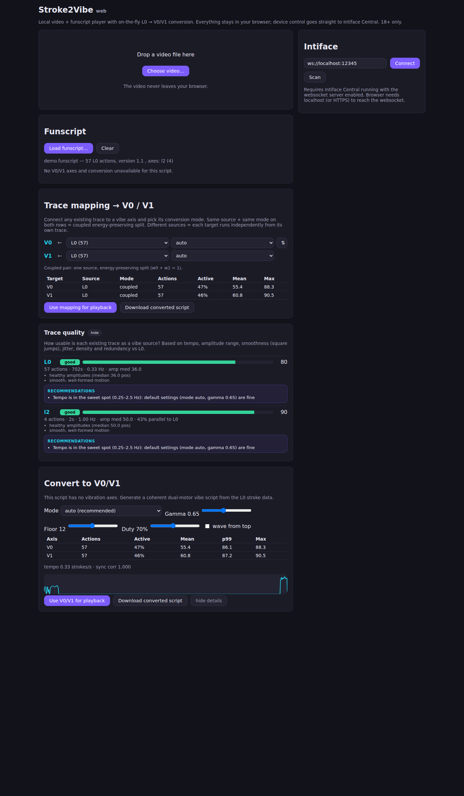

# Stroke2Vibe



## Tools

| Tool | Purpose |
|---|---|
| `Stroke2Vibe.exe` (this repo, classic) | Interactive stroke → single vibe conversion console |
| [`auto/`](auto/) | **Stroke2VibeAuto** — standalone, converts a stroke (L0) script into a coherent dual-vibe (V0/V1) script, embedded as a single-file multi-axis funscript |
| [`web/`](web/) | **Stroke2Vibe Web** — local video player + funscript sync + on-the-fly conversion + Intiface/buttplug.io device control |

## What's new (2026)

Major additions on top of the original console tool — see [`docs/ROADMAP.md`](docs/ROADMAP.md) for details:

- **Stroke2VibeAuto** (`auto/`): fully automatic L0 → V0/V1 conversion (energy-preserving
  envelope split, motor floor/rate-cap, end-stop), embedded as standard single-file
  multi-axis funscript; 5 split modes (auto/travel/alternate/layer/surge), in-place with
  `.bak`, `--split`, `--stats`
- **Stroke2Vibe Web** (`web/`): Svelte 5 SPA — local video playback with funscript sync,
  **on-the-fly L0 → V0/V1 conversion** (same pipeline as the C++ reference, parity-tested),
  trace remapping (any axis → V0/V1 with per-trace conversion modes), auto wave profiles
  (softer/balanced/stronger/extreme + full manual knob grid: target, gamma, gate, smoothing,
  floor, baseline, ripple, duty, layer depth/rate, stroke accent, reversal kick, floor ramp,
  section dynamics), vacuum/suction track generator (incl. pump-pulse mode for devices that
  can't hold vacuum), waveform display for all traces with zoom/seek/playhead + section
  overlays, and direct **Intiface Central (buttplug.io)** device control with per-motor
  power limits, consent switch and kill switch
- Screenshots: [`web/docs/`](web/docs/) (start view, panels, Intiface panel)

## Compilation
Compiling Requires Visual Studio 2019 or newer and vcpkg

install antlr4 with [vcpkg](https://github.com/microsoft/vcpkg):
```
c:\vcpkg\vcpkg.exe install antlr4
c:\vcpkg\vcpkg.exe install antlr4:x64-windows
```

make sure, vcpkg is integrated with Visual Studio:

```
c:\vcpkg\vcpkg.exe integrate install
```

Compile with Visual Studio as usual.

## Description

What does the Program do:
	Read a funscript for stroking
	Transform the script into a funscript for vibrators
	Manual Optimizations depending on personal Taste
	Save Vibration Funscript on HDD
	
What does the Program not do:
	Have a graphical Interface
	Let you make a funscript from scrath
	Let you manipulate stroke scripts before conversion (use other tools for that)
	Automatically Optimize.
	
	
	
Tips before usage:
1. Add the programm to your PATH variable so you can invoke it from everywhere
2. Under windows you can start a Terminal in the current folder by typing "cmd" in the adress bar and hitting enter

Usage:
1. Open a terminal in the folder your stroking script is in
2. In the Terminal type: Stroke2Vibe.exe myscript.funscript
		myscript.funscript is the script you want to convert
		stroke2vibe.exe has to either be in the same folder or added to you path variables
		libantlr4-runtime.dll has to be in the same folder as the exe.
3. The program Converts the script for you and shows you commands to manipulate the script

Usage tips:
1. Use Script statistics to check your average script values etc.
2. There might be a small amount of very high values wich lowered the value of the other actions
	To fix multiply all values with multiplier >1 and the Sanitize
3. Using SQRT and the Multiplying by e.g. 8 decreases high values slightly and drastically increases very low values
4. In a stroke script small strokes near the top are probably more intense while strokes at the bottom are less intense. You can Multiply values according to that logic with Hotkey "e"
5. Press 1 to clear your screen
6. Shorten before saving (recommend value between 1 and 5)

## Remarks

This code is copied from https://discuss.eroscripts.com/t/stroke2vibe-converts-scripts-for-stroking-toys-to-vibrating-toys-scripts/47225 and converted to use Visual Studio for easier deployment. Thanks to stapapap for the code!